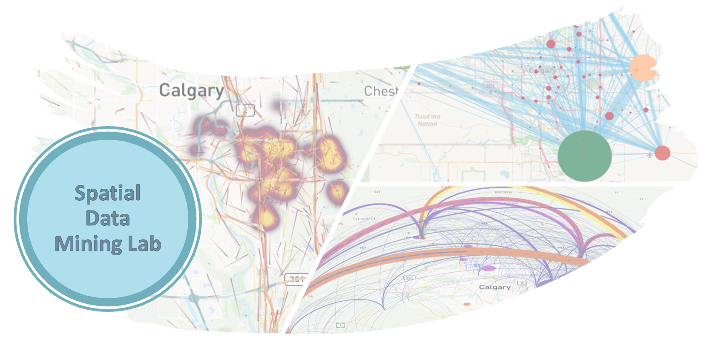

Welcome to Spatial Data Mining Lab 2024!
========================================

The **Spatial Data Mining (ENGO 645)** course introduces you to exploring spatial data and using it practically. 
In these lab assignments, you'll learn to apply these techniques using Python in a way that's easy to understand.

Lab format
-------------

Each assignment focuses on specific topics from our lectures. 
First, you'll have a tutorial where we'll guide you through solving specific problems using Python. 
Then, there are tasks related to the tutorial that serve as your homework. 
You'll need to write programs and submit them. 
You may be asked to submit the Python codes you have written, output figures and answers to related questions.

.. important::
    While it's great to work together with other students, make sure your submissions reflect your own work. 
    (in short, don't copy/paste from other students).

.. admonition:: Teaching Details
    
    - All regular course lectures happen in the classroom.
    - Our labs will mix in-person and online experiences. You'll find tutorials and resources online, but we'll also have some lab sessions in person for more interaction.
    - Need help outside class? You can always post your questions or join discussions on the course's D2L platform.

Grading
-------

Assignments grades will be given based on a scale from 0 to 5, following the standard grading system.

Preliminary Grading Thresholds
~~~~~~~~~~~~~~~~~~~~~~~~~~~~~~

- 90% of the total possible points or higher → Score of 5
- 80% of the total possible points or higher → Score of 4
- 70% of the total possible points or higher → Score of 3
- 60% of the total possible points or higher → Score of 2
- 50% of the total possible points or higher → Score of 1

.. note::
    Make sure to submit your assignments on time. Generally, assignments are due within two weeks (we'll let you know the exact date and time for each assignment). 
    If you need a bit more time, no worries! Late submissions within 24 hours will have a small -10% penalty, and within 48 hours, it's just a 20% reduction. 
    But after 48 hours, sorry, no more submissions accepted, and you'll lose the marks for that assignment.

General Goals
-------------

Throughout our lab assignments, here's what we'll dive into:

1. You'll grasp fundamental Python programming concepts that'll empower you to solve real-world problems using short Python programs.

2. Practice the spatial data mining concepts taught in our lectures by manipulating, analyzing, and visualizing scientific data using Python.

3. Learn the art of version control with Git and how to utilize online repositories like GitHub to document and share your fantastic work.

Each week, we'll explore different themes aligned with the course's essence, completing them step by step over the semester.

Our exciting journey spans 13 weeks, starting on January 8th, 2024, throughout the winter semester. Look out for updated materials right here on our lab page to keep our lab adventures fresh and engaging.

+-------------+--------------------------------------------+
| Assignment  | Topic                                      |
+=======+==================================================+
| **0** | (kick-off) Installing Python + Setting up GitHub |
+-------+--------------------------------------------------+
| **1** | Data preparation with pandas and Visualization   |
+-------+--------------------------------------------------+
| **2** | Market Basket Analysis, Frequent Pattern Mining  |
+-------+--------------------------------------------------+
| **3** | Classification and Spatial Analysis              |
+-------+--------------------------------------------------+
| **4** | Spatial Clustering                               |
+-------+--------------------------------------------------+
| **5** | (Optional) Spatial-Temporal Trajectory Mining    |
+-------+--------------------------------------------------+

.. toctree::
    :maxdepth: 2
    :caption: Kick-off Assignment

    tutorials/L1/overview
    tutorials/L1/python_installation
    tutorials/L1/git_and_github
    tutorials/L1/prepration
    tutorials/L1/assignment-1

.. toctree::
    :maxdepth: 2
    :caption: Assignment 1

    tutorials/L2/overview
    tutorials/L2/libraries
    notebooks/L2/using_pandas
    notebooks/L2/plotting
    tutorials/L2/tasks
    
.. toctree::
    :maxdepth: 2
    :caption: Assignment 2

    notebooks/L3/association_rules
    notebooks/L3/geopandas
    tutorials/L3/tasks

.. toctree::
    :maxdepth: 2
    :caption: Assignment 3

    tutorials/L4/classification
    notebooks/L4/classification_with_python
    tutorials/L4/tasks

.. toctree::
    :maxdepth: 2
    :caption: Assignment 4

    tutorials/L5/tasks
