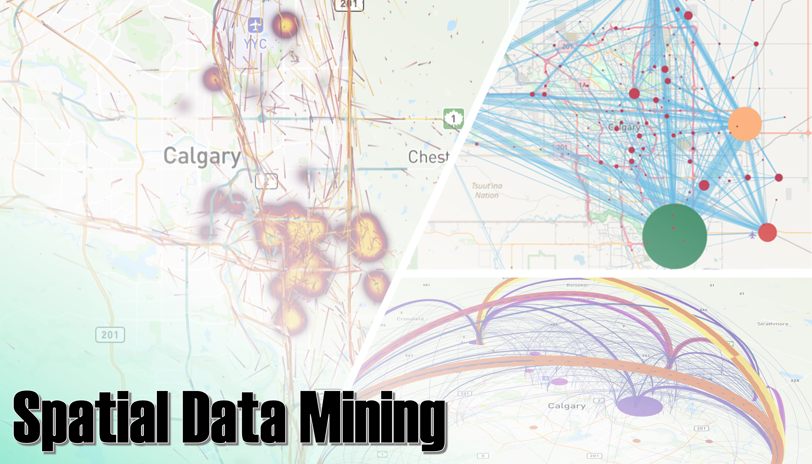

Welcome to Spatial Data Mining Lab 2024!
===========================

The **Spatial Data Mining** course teaches you the basic concepts of data mining and applications on working with spatial data, and in the course Lab you will be training to apply data mining techniques on spatial data using the Python programming language in a format that is easy to learn and understand.
Each exersice includes a tutorial with specific topic(s) where the aim is to gain skills and understanding how to solve common data-related tasks using Python.

Lab format
-------------

The majority of the ENGO 645 course will be spent on-site in the classroom spatial data mining learning concepts and applications.
The course consists of interactive lectures and bi-weekly assignments.
The assignments will focus on developing basic programming skills using Python and applying those skills to various spatial analytical problems.
Assignments will involve a brief tutorial introduction followed by topical computer-based tasks.
For each assignment, you may be asked to submit the Python codes you have written, output figures and answers to related questions.
You are encouraged to discuss and work together with other students while working on the assignments.
However, the exercises you submit must must clearly reflect your own work (in short, don't copy/paste from other students).

.. admonition:: Teaching Details
    
    - All regular classes will be conducted on-site throughout the semester.
    - Our lab sessions will be a blend of on-site and online experiences, offering a hybrid approach to optimize your learning journey.
    - For additional assistance or queries beyond class hours, you can engage in discussions and seek clarification on the course content through the discussion board on the course's D2L platform. Moreover, scheduled online office hours will be available for addressing any concerns or inquiries.

General Goals
-------------

After completing this course, students will (1) understand basic programming concepts, (2) be able to write short programs, and (3) manipulate, analyze, and visualize scientific data using Python.
Students will also learn to use version control (git) and online repositories (GitHub) for documenting and sharing their work.
Themes for each week are listed below and will be completed during the semister.

The course runs for 13 weeks in the winter semester starting on the 8th of January 2024.
New materials for the Labs will be updated on this course page accordingly.

+-------+---------------------------------------+
| Week  | Topic                                 |
+=======+=======================================+
| **1** | Installing Python + Setting up GitHub |
+-------+---------------------------------------+

.. toctree::
    :maxdepth: 2
    :caption: Kick-off Assignment

    tutorials/L1/overview
    tutorials/L1/assignment-1

