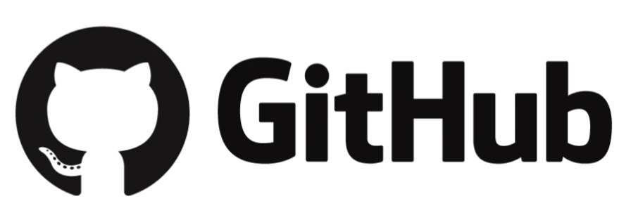
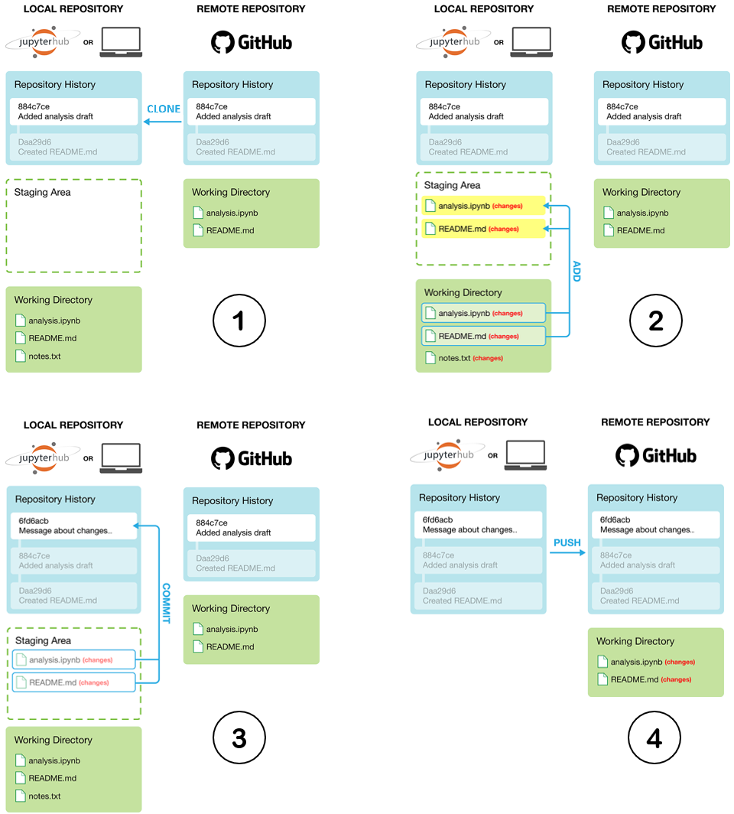
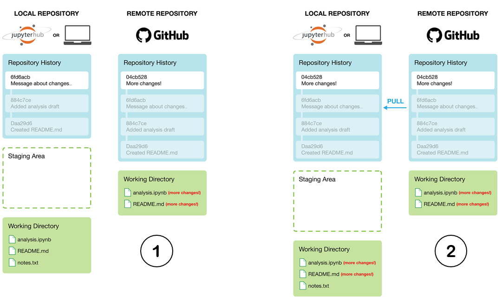

Introduction to version control with Git and GitHub
===================================================

.. What is version control?
.. What is Git?
.. What is GitHub?
.. Basic vocabulary
.. Key concepts

This tutorial covers the very basics of `version control <https://en.wikipedia.org/wiki/Version_control>`__ using `Git <https://en.wikipedia.org/wiki/Git_(software)>`__, `GitHub <https://github.com/>`__, and JupyterLab git plugin.

Sources
-------

These materials have been adapted from:

- `Version Control with Git <http://swcarpentry.github.io/git-novice/>`__
- `GitHub Education Campus Advisors resources <https://github.com/Campus-Advisors>`__
- `Git documentation <https://git-scm.com/about/>`__
- `GitHub Campus Advisor materials <https://education.github.com/teachers/advisors>`__
- `Geo-Python Course <https://geo-python-site.readthedocs.io/en/latest/lessons/L2/git-basics.html>`__
- `Data Science: A First Introduction <https://datasciencebook.ca/version-control.html>`__

What is version control and why should I use it?
------------------------------------------------
Imagine your code as an evolving storybook, where every line written is a new chapter. 
Version control is like a magic quill that records every change, every plot twist, and character development in this coding adventure.
Version control systems are like time-traveling wizards for your documents! 
They start with a magical base version and then keep a record of every change you make along the way. 
It's like rewinding your favorite movie, starting from the beginning and watching each cool edit you've made until you reach your latest masterpiece!

.. figure:: img/version_control_02.png
   :alt: Motivation for version control

   Source: "Piled Higher and Deeper" by Jorge Cham, http://www.phdcomics.com

**Why Should We Use Version Control?**

- **History Keeper:** Version control systems, like Git, maintain a detailed history of changes made to your code. It's a time machine allowing you to revisit any point in your project's history.
- **Undo & Redo Magic:** Made a mistake? Version control lets you rewind! It's like an "Undo" button for your code, helping you revert to a previous state effortlessly.
- **Collaboration Made Easy:** Imagine working on a group project without version control—it's like writing a book together without being able to share drafts! Version control makes collaborating a breeze, allowing multiple people to work on the same codebase without chaos.
- **Experimentation & Branching:** Want to experiment with new features without breaking everything? Version control introduces branching—creating alternative storylines for your code, exploring new ideas without affecting the main plot.
- **Backup & Safety Net:** Your code is valuable! Version control provides a safety net by keeping your code stored safely, like a backup that you can always rely on.

.. admonition:: What is Git?

    `Git <https://en.wikipedia.org/wiki/Git_(software)>`__ is a version control software that is used to track and store changes in your files (often source code for programs) without losing the history of past changes. 
    Files in Git are stored in a repository, which you can simply think of as a directory containing files (or other directories) related to a single 'project'. Git is widely used by professionals to keep track of what they’ve done and to collaborate with other people.

What is GitHub?
---------------

`GitHub <https://github.com/>`__ is a web based Git repository hosting service and social network. 
GitHub is the largest online storage space where coders gather, share ideas, and collaborate on projects. 
It's more than just version control; it's a hub for open-source contributions, a portfolio showcase, and a networking paradise for coding enthusiasts worldwide.
GitHub provides a nice web-interface to your files that is easy to use. 

GitHub's Superpowers:
~~~~~~~~~~~~~~~~~~~~~

1. **Public Repositories & Open Source:**

GitHub hosts open-source projects, allowing anyone to contribute and learn from the vast library of code available.

2. **Issue Tracking & Discussions:**

Discuss ideas, report bugs, and track progress through GitHub's issue tracking system—a virtual space for coding dialogues.

3. **Pull Requests & Collaboration:**

Submit pull requests to propose changes or improvements to projects, fostering a collaborative atmosphere among developers.

Key Concepts in Version Control with Git and GitHub
---------------------------------------------------

Git serves as our time-traveling historian for code! It records changes made to our files over time, preserving every twist and turn in our coding journey.
A "repository," often called a "Git project" or simply "repo", is like a container that holds all the files and folders associated with a project. 
It's where Git stores the complete history of changes for each file. 
You can maintain your files on your local computer, creating a dedicated local repository. Additionally, you can establish a remote repository hosted on GitHub servers.
In general, it is recommended that each project, library or discrete piece of software should have it's own repository.
For example, each assignment in this course has it's own repository on GitHub.

Cloning a Repository:
~~~~~~~~~~~~~~~~~~~~~
We begin by duplicating an existing repository from GitHub onto our computer with git clone. 
Think of it as getting your hands on a unique copy of our assignment project. 
This copy is yours to explore, work on, and personalize according to your coding style and ideas.

Publishing Changes:
~~~~~~~~~~~~~~~~~~~
In order record changes to our files, we first add changes to a so called staging area (using the command ``git add``). 
The idea is, that you can have a (sometimes messy) working directory, and by using ``git add`` you tell Git which files to include in the next committed snapshot. 
Then, the command ``git commit`` records a permanent snapshot of the staged changes.
Once you have made one or more commits that you want to share with your collaborators, you need to push (i.e., send) those commits back to GitHub. 
This updates the history in the remote repository (i.e., GitHub) to match what you have in your local repository. 
`Read more about basic snapshotting <https://git-scm.com/book/en/v2/Appendix-C:-Git-Commands-Basic-Snapshotting>`__.

    
    Version control steps using Git (adapted from `Data Science: A First Introduction <https://datasciencebook.ca/version-control.html#overview-12>`__).

Syncing Changes:
~~~~~~~~~~~~~~~~
If you are working on a project with collaborators, they will also be making changes to files.
To obtain the new changes from the remote repository on GitHub, you will need to pull those changes to your own local repository. 
By pulling changes, you synchronize your local repository to what is present on GitHub.

    
    Update your Git project local repository using pull commands. Always pull before you push (especially when working in a shared project)!

.. note::

    During this course, we often start by cloning an existing repository from GitHub
    to our own computer using ``git clone``. Using ``git pull`` we can fetch (and merge) new changes from GitHub,
    and ``git push`` publishes our local changes to GitHub. 

    `Read more about sharing and updating Git projects <https://git-scm.com/book/en/v2/Appendix-C:-Git-Commands-Sharing-and-Updating-Projects>`__.

Basic vocabulary
~~~~~~~~~~~~~~~~

Here are a few basic terms that are used often when using git and GitHub (not exhaustive).

-  **Repository** = a location where all the files for a particular
   project are stored, usually abbreviated as "repo." Each project will
   have its own repo, which is usually located on a server and can be
   accessed by a unique URL (a link to GitHub page for example).

-  **Commit** = To commit is to write or merge the changes made in the
   working copy back to the repository. When you commit, you are
   basically taking a "snapshot" of your repository at that point in
   time, giving you a checkpoint to which you can reevaluate or restore
   your project to any previous state. The terms 'commit' or 'checkin'
   can also be used as nouns to describe the new revision that is
   created as a result of committing.

-  **Revision / version** = A revision or a version is any change in
   made in any form to a document(s).

-  **Clone** = Cloning means creating a repository containing the
   revisions from another repository. This is equivalent to pushing or
   pulling into an empty (newly initialized) repository. As a noun, two
   repositories can be said to be clones if they are kept synchronized,
   and contain the same revisions.

-  **Pull / push** = Copy revisions from one repository to another.
   Pull is initiated by the receiving repository, while push is
   initiated by the source. Fetch is sometimes used as a synonym for
   pull, or to mean a pull followed by an update.

-  **Merge** = A merge or integration is an operation in which two sets
   of changes are applied to a file or set of files.

Summary
-------
After this lesson you understand the basic concepts of version control using Git and GitHub.

