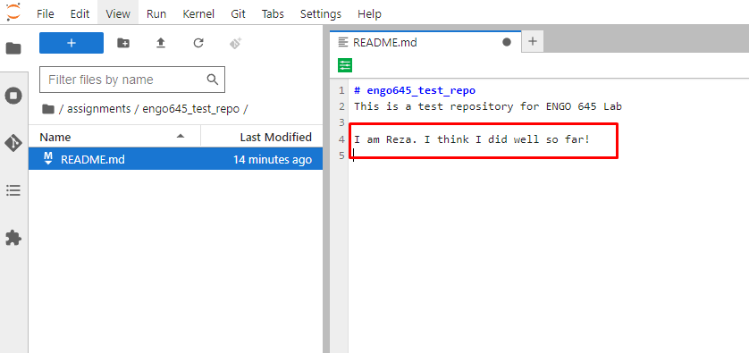

Preparations
===================================================

.. create github account
.. JupyterLab git plugin
.. Git from the command line
.. Using Classroom for Github

Let's go through the basics of using Git. We are going to see how we can create a github account and create a new repository in GitHub.
Then we are going to see how we can clone a repository from GitHub to our JupyterLab session, and how we can make changes to the repository and push them to GitHub.

Sources
-------

These materials have been adapted from:
- `Data Science: A First Introduction <https://datasciencebook.ca/version-control.html>`__
- `Geo-Python Course <https://geo-python-site.readthedocs.io/en/latest/lessons/L2/git-basics.html>`__

Create a GitHub account
-----------------------

You will need an account for `GitHub <https://github.com/>`__ to follow the rest of the steps.

- Go to `https://github.com <https://github.com/>`__ and follow the “Sign up” link at the top-right of the window.
- Follow the instructions to create an account.
- Verify your email address with GitHub.
- Configure multifactor authentication if needed.

Creating a remote repository on GitHub
--------------------------------------

Once you have logged into your account, you can create a new repository to host your project by clicking on the “+” icon in the upper right-hand corner, and then on :kbd:`New Repository`.

    
    New repositories on GitHub 

    
    Repository configuration for a new project on GitHub 

Repositories can be set up with a variety of configurations, including a name, optional description, and the inclusion (or not) of several template files. 
One of the most important configuration items to choose is the visibility to the outside world, either public or private. 
Public repositories can be viewed by anyone. Private repositories can be viewed by only you. 
Both public and private repositories are only editable by you, but you can change that by giving access to other collaborators.

Generating a GitHub personal access token
-----------------------------------------

To send and retrieve work between your local repository in your computer and the remote repository on GitHub, 
you will need to authenticate with GitHub to prove you have the required permission. 
One of the easiest methods to do this is by using a "personal access token". 
Think of it as your special key to unlock the door between your local and online repositories. It makes the whole process smoother and secure.
There are several methods to do this, using a personal access token is the easiest way to do this.
We'll cover the basics of setting this up here, but for more detailed steps and information, you can explore the `GitHub documentation <https://docs.github.com/en/github/authenticating-to-github/keeping-your-account-and-data-secure/creating-a-personal-access-token>`__.

.. note::

    A personal access token is like a password—so keep it a secret!

If you have not already verified your email address, make sure to do so in your GitHub settings (`GitHub email verification <https://docs.github.com/en/get-started/signing-up-for-github/verifying-your-email-address>`__). 

#. To generate a personal access token, you must navigate into your settings on GitHub. To do this, click on your profile picture in the top right corner of the screen and then click on **Settings**.
#. Click on **Developer settings** in the left sidebar.
#. Click on **Personal access tokens**.
#. Click on **Tokens (classic)**.
#. We will create the token by clicking on **Generate new token** and then **Generate new token (classic)**.

   - If you are using two-factor authentication, you may be prompted to enter an authentication code at this point.
 
#. We can start by giving our token a name in under **Note** to describe the purpose for our personal access token.

#. We can then give the token an expiration date. You can choose the duration you prefer, but it would be best to set it to at least the end of the year.

   .. image:: img/access_token_01.png
      :width: 700
      

#. Now we need to set the permissions, or scopes, that our token is granted. We are going to need it to be able to access and change our exercise repositories. For that, we can select the check boxes for **repo**, **admin:repo_hook**, and **delete_repo**.

   .. image:: img/access_token_02.png
      :width: 600

#. At this point we can click the **Generate token** button to create and see our token.

#. We are then presented with our Personal access token, click the copy button to copy it to your clipboard and then paste it into a text file in the JupyterLab session.

   - Open a text document and copy and paste your Personal access token in a text file, because for now we are going to use it like this, and we will later see how we can cache it so that we don't need to copy and paste it every time we need it. If your access token is ever lost, you can just follow the steps above again to create a new one.

   .. image:: img/access_token_03.png
      :width: 600

Now that we have created a personal access token, the next thing we need is the URL of your personal repository (that you learned how to create in previous section) from GitHub. 

On GitHub, find the button :guilabel:`<> Code` and copy the url under *HTTPS*.

The URL looks something like this:
``https://github.com/safarzadeh-reza/engo645_test_repo.git`` but with your own username and repo name.

JupyterLab git plugin
---------------------

Clone a repository from GitHub
~~~~~~~~~~~~~~~~~~~~~~~~~~~~~~

In order to get a copy of your remote repository on our own computer (or the cloud computer), you need to ``clone`` it.

To install the Git extension in your JupyterLab environment, follow these steps:

1. Open JupyterLab from Anaconda Navigator.
2. On the main page, navigate to the Terminal.
3. In the Terminal, enter the following code to install the Git extension:
   
   ::
   
      pip install --upgrade jupyterlab jupyterlab-git
      jupyter lab build

or with conda:

   ::
   
      conda install -c conda-forge jupyterlab jupyterlab-git
      jupyter lab build

When you successfully installed the Git extension for JupyterLab, you should see a new Git icon in the left sidebar:

Check here for more information on installing `JupyterLab Git extension <https://github.com/jupyterlab/jupyterlab-git>`__.

After installing the extension, navigate to the **my-work** folder in JupyterLab and create a new folder inside it called **assignments**, and double-click to enter that folder. 
Next, activate the git-plugin. The plugin will tell you that **assignments** is not a Git repository and gives you some options.

In our case, we want to **Clone a Repository**. Go ahead and paste your exercise repository URL into the pop-up window:

.. note::
    
    On the command line this action is equivalent to the ``git clone`` command.

.. note::

    **Pay attention to which folder you are in!** Git will create a new folder under the folder you
    are located in when cloning a repo.

On the file browser tab, you will now see a folder for the repository. Inside this folder will be all the files that existed on GitHub.

Credentials
~~~~~~~~~~~

Git needs to know who you are in order to give you access to remote repositories.

**Insert your GitHub username and personal access token**:

Now you should see a new folder in JupyterLab that is identical to the repository on GitHub.

.. note::
    
    On the command line, credentials can be managed using ``git config``.

Now you can create a new notebook or open an existing one and start working on the assignments!

.. note::

    During this course, we will most often start working with the assignments using an existing repository on GitHub which contains the assignment instructions and some starter code.

Add changes
~~~~~~~~~~~

Let's start making changes in the repository! Open the ``README.md`` file and make some edits. For example, add some text at the end of the file:

    Edit a file in JupyterLab

Or you can add a new python notebook to the repository:

    Create a new notebook in JupyterLab

After saving your changes, check the status of the repository. You should see ``README.md`` listed under **Changed** files, and the new notebook under **Untracked** files:

    Changes visible in the Git plugin

These changes are not yet "staged for commit", which means that we need to add them first to the staging area. 
Clicking the plus sign (+) moves the file from the “Untracked” heading to the “Staged” heading, so that Git knows you want a snapshot of its current state as a commit.

.. figure:: img/git-plugin-stage-changes.png
    :width: 350

After adding the changes, you should see the changed file under **Staged** in the Git plugin.
Now you are ready to “commit” the changes. 
Make sure to include a (clear and helpful!) message about what was changed so that your collaborators (and future you) know what happened in this commit.

.. note::
    
    On the command line, ``git add`` is the command for adding changes to the staging area.

Commit changes
~~~~~~~~~~~~~~

Once the changed files are in the staging area, we can create a permanent snapshot by committing the changes.
Always remember to write an informative commit message to accompany your changes:

.. figure:: img/git-plugin-commit.png
    :width: 300

Once you hit the commit button, the plugin will most likely ask your name and email.

You can insert the same details you used when signing up to GitHub.

.. figure:: img/git-plugin-commit-ok.png

Once the commit succeeds, you should see the latest set of changes under the History tab in the Git plugin:

.. figure:: img/git-plugin-history1.png

*Note: You might also see some previous changes by the course instructors. These changes have been generated automatically and you can ignore them.*

On the command line the syntax for committing is ``git commit -m "commit message"``. After committing, it is good practice to check the repository status using ``git status``.

.. note::

    We can **tell Git to remember our GitHub username and access token** to avoid typing them in all the time. Open up a Terminal window and type in this command:

    ``git config --global credential.helper 'store --file /home/jovyan/my-work/.git-credentials'``

    Then change the folder you are in by typing (with your username):

    ``cd exercises/exercise-1-davewhipp/``

    We then pull from our GitHub repository:

    ``git pull``

    Type your username, press enter, and go to the text file with your access token, copy it, and paste into your terminal with **Ctrl** + **v** and press **Enter**. Then your username and access token should be stored and you can pull and push to and from GitHub without having to type your access token every time.

Push changes to GitHub
~~~~~~~~~~~~~~~~~~~~~~

Next, we want to synchronize our local changes with the remote repository on GitHub.

.. figure:: img/git-plugin-pull-push-buttons.png

    Buttons for Pulling and Pushing changes between the local and remote repositories

First, it's good to use :code:`git pull` (button with arrow down) to double check for remote changes before contributing your own changes.

In this case, the repository is probably up-to-date and no new changes are downloaded. However, it is good practice to always use git pull before publishing your local changes in case someone made changes in the remote repository in the meanwhile!

Now we are ready to push the local changes to GitHub using :code:`git push` (button with arrow up):

Now you should see the updates in GitHub! Go and have a look at your personal repository in https://github.com/Geo-Python-2023/ .

On the command line, ``git pull`` fetches and merges changes from the remote repository, and ``git pull`` publishes local changes.

That's all you need to know about Git for now :)

Git from the command line
-------------------------

There are many different ways of using Git, and you might want to try out using Git from the command line at some point.

Terminal
~~~~~~~~

.. note::
    You will need to know a couple of basic command line commands in order to use Git from the command line. Code Academy's `list of command line commands <https://www.codecademy.com/articles/command-line-commands>`__ provides
    a good overview of commonly used commands for navigating trough files on the command line. For using Git on the command line, you should at least be familiar with these commands:

    - ``ls`` - list contents of the current directory
    - ``ls -a`` - list contents of the current directory including hidden files
    - ``cd`` - change directory. For example, ``cd exercises``
    - ``cd ..`` - move one directory up

**Start a new Terminal session in JupyterLab** using the icon on the Launcher, or from *File* > *New* > *Terminal*.

.. figure:: img/terminal-icon.png

**Check if you have git installed** by typing :code:`git --version` in the terminal window:

.. code-block:: bash

    git --version

Anything above version 2 is just fine.

.. note::

    You can paste text on the terminal using :code:`Ctrl + V` or :code:`Shift + Right Click --> paste`

Configuring Git credentials
~~~~~~~~~~~~~~~~~~~~~~~~~~~

Configure Git to remember your identity using the ``git config`` tools. You (hopefully) only need to do this once
if working on your own computer, or on a cloud computer with persistent storage on CSC notebooks.

.. code-block:: bash

    git config --global user.name "[firstname lastname]"
    git config --global user.email "[email@example.com]"

Basic commands
~~~~~~~~~~~~~~

The basic workflow of cloning a repository, adding changes to the staging area, committing and pushing the changes can be completed using these command line commands:

- ``git clone [url]`` - retrieve a repository from a remote location (often from GitHub)
- ``git status``- review the status of your repository (use this command often!)
- ``git add [file]`` - add files to the next commit (add files to the staging area)
- ``git commit -m "[descriptive message]"`` - commit staged files as a new snapshot
- ``git pull`` - bring the local branch up to date (fetch and merge changes from the remote)
- ``git push`` - transmit local branch commits to the remote repository

.. note::

    Remember to use ``git status`` often to check the status of our repository.

.. admonition:: Other useful Git commands

    Check out other commonly used git commands from `the GIT CHEAT SHEET <https://education.github.com/git-cheat-sheet-education.pdf>`__

.. admonition:: Remote repository

    Remote repositories are versions of your project that are hosted on a network location (such as GitHub).
    When we cloned the repository using ``git clone``, Git automatically started tracking the remote repository from where we cloned the project.
    You can use the ``git remote -v`` command to double check which remote your repository is tracking.

    **A common mistake during this course is that you have accidentally cloned the template repository in stead of your own/your teams repository.**

    `Read more about managing remotes <https://git-scm.com/book/en/v2/Git-Basics-Working-with-Remotes>`__.

.. admonition:: Main branch

    **Branches and branching** are powerful features in Git that allow maintaining parallel versions of the same project.
    During this course you don't need to worry too much about branches. However, it is good to understand that **we are working on the main branch of our repository**. For example, when using the ``git push`` command,
    the full syntax is ``git push origin main`` which means that we are pushing the changes to the main branch of the remote repository called origin. `Read more about git branches <https://git-scm.com/docs/git-branch>`__.

Resolving conflicts
-------------------

It is possible that you will encounter a **merge conflict** at some point of this course. A merge conflict might happen if two users have edited the same content, or if you
yourself have edited the same content both on GitHub and locally without properly synchronizing the changes. In short, Git will tell you if it is not able to sort out the version history of your project by announcing a merge conflict.

We won't cover how to solve merge conflicts in detail during the lessons. You can read more about `how to resolve merge conflicts from the Git documentation <https://git-scm.com/docs/git-merge#_how_to_resolve_conflicts>`__.
**The best thing to do to avoid merge conflicts is to always Pull before you Push new changes.**
In case you encounter a merge conflict, don't panic! Read carefully the message related to the merge conflict, and try searching for a solution online and ask for help on Slack.

Remember that you can always download your files on your own computer, and upload them manually to GitHub like we did in Exercise 1!

.. figure:: https://imgs.xkcd.com/comics/git.png
    :alt: https://xkcd.com/1597/

    Source: https://xkcd.com/1597/

Summary
-------
After this lesson you should be able to do these steps in JupyterLab using git and the JupyterLab git-plugin:

1. `Clone a repository from GitHub`_
2. `Add changes`_
3. `Commit changes`_
4. `Push changes to GitHub`_

These steps can be completed either using the `JupyterLab git plugin`_ (we recommend this option for beginners) or using
`Git from the command line`_.