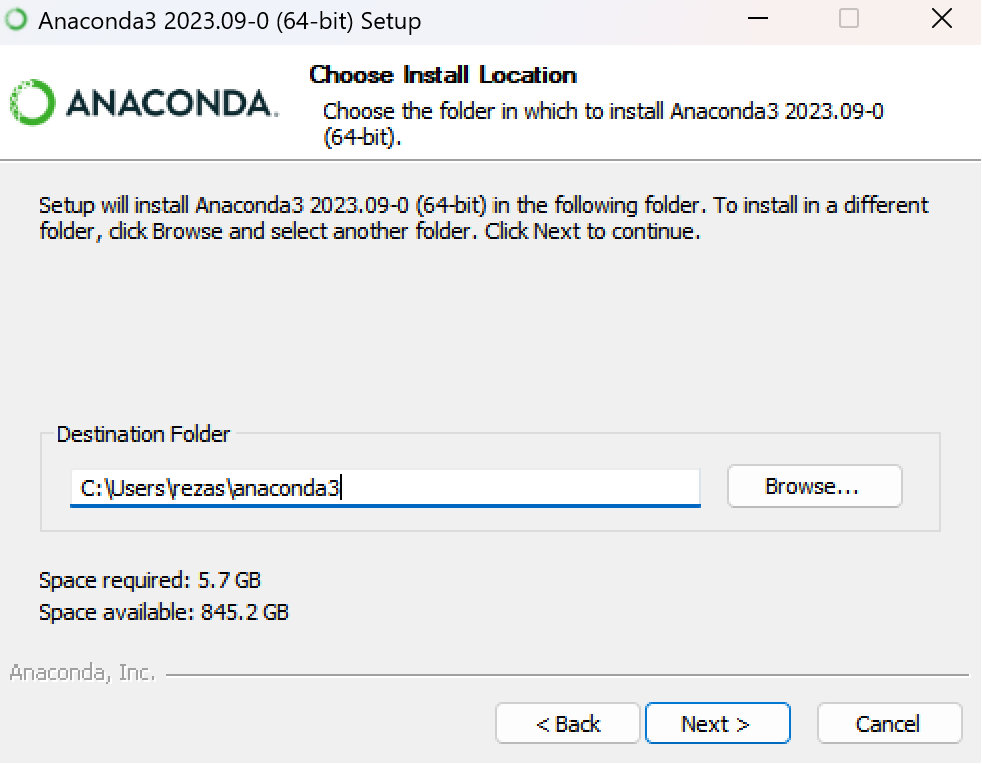
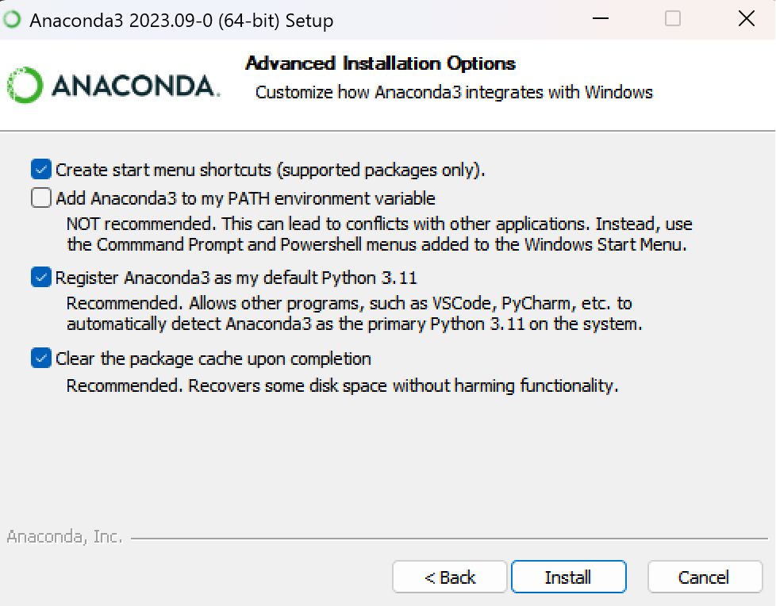
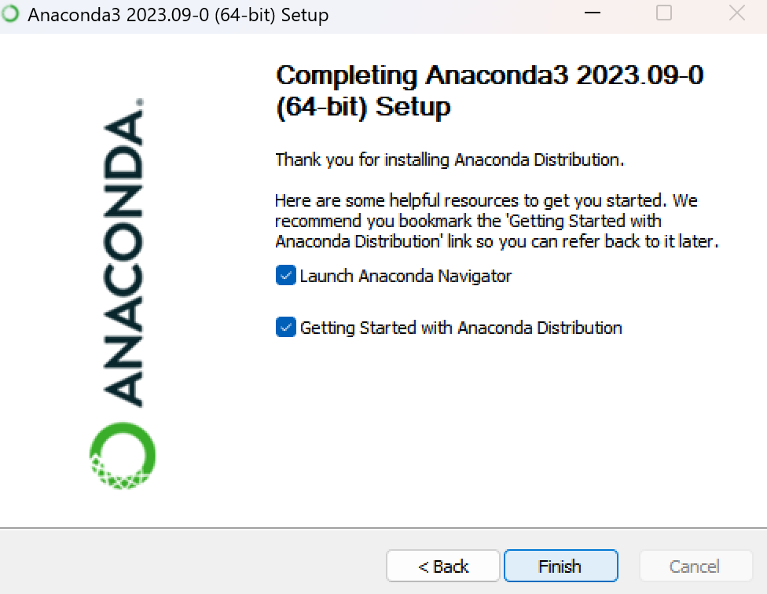
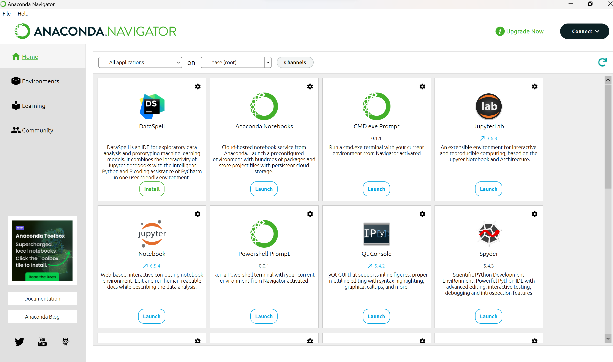
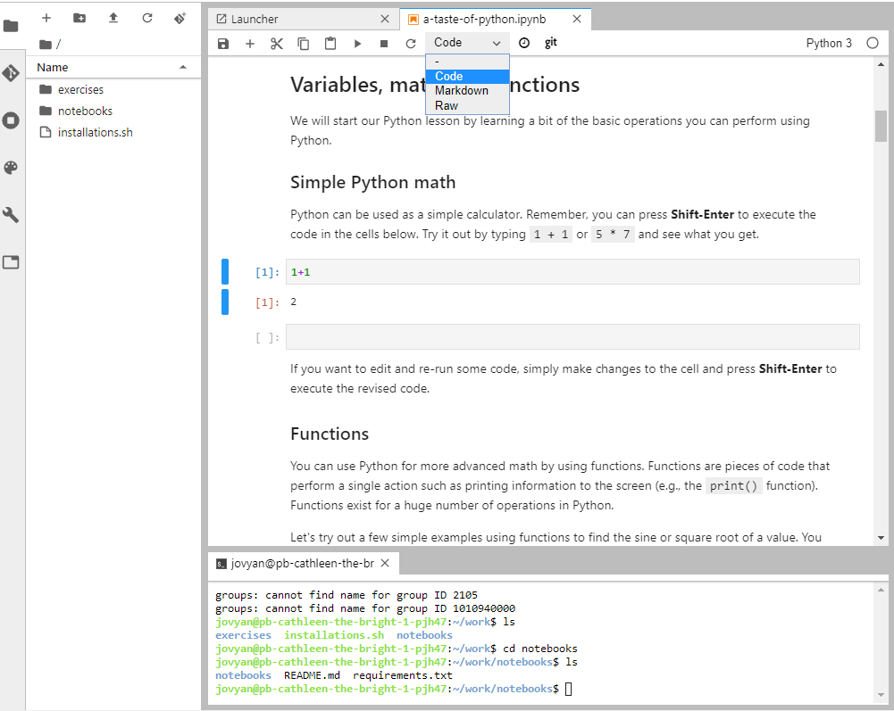

Installing Python and Python packages
=====================================

When you want to use Python to write scripts and programmes on your own computer, you need to install Python, 
and possibly some of the many packages for it that provide tools for specific tasks, such as handling GIS data sets. 
On this page, we present one of the ways to install Python and Python packages. 
During this tutorial, we will use the conda package management system, 
and below you will find installation instructions of Anaconda distribution on different operating systems.

.. note:: Do I need to install anything?

    You can complete all assignments without installing anything on your computer. 
    The code of each assignment can be completed and run interactively in the web browser based platforms such as Google Colab.
    As long as you can provide the tasks requirements you are free to use any other online or desktop platfrom to write your python codes and markdowns.

What is Anaconda?
-----------------
Anaconda is a distribution of the Python and R programming languages for scientific computing, 
that aims to simplify package management with conda environments.

Anaconda offers the easiest way to perform data science and machine learning on a single machine.

Install Anaconda
----------------

Microsoft Windows
~~~~~~~~~~~~~~~~~
Download the latest installation package from the `Anaconda download page <https://www.anaconda.com/download>`_. 

Once the download has finished, double-click the downloaded installer file to start installation. 
Following the instructions through the installation steps, you can choose the destination folder you want to install Anaconda in.
Install Anaconda to a directory path that does not contain spaces or unicode characters.

Then Choose the defaul checkbox register Anaconda as your default Python. Don't check the "add Anaconda to your PATH environment"
unless you have or you want to install different version of python in your system. Otherwise just use the default setting.

.. note::
   If you encounter issues during installation, temporarily disable your anti-virus software during install, 
   then re-enable it after the installation concludes.

After installation has sucessfully completed, start an Anaconda NAvigator that has been newly added to your Start Menu to confirm that it has been installed successfuly on your system.

.. note::
Anaconda Navigator is a graphical user interface (GUI) that is automatically installed with Anaconda. 
Navigator will open if the installation was successful. 
If Navigator does not open, something went wrong with your installation.

MAcOS
~~~~~

JupyterLab
----------

`JupyerLab <https://jupyterlab.readthedocs.io/en/stable/getting_started/overview.html>`__ is an open-source web-based user interface for doing data science.
The JupyterLab interface consists of different components such as a file browser, terminal, image viewer, console, text editor, etc.

**Jupyter Notebooks** (filename extension ``.ipynb``) are documents inside the JupyterLab environment which contain computer code, and rich text elements (figures, links, etc.).
Jupyter Notebooks are perfect for documenting a data science workflow in an interactive format.

**We use JupyterLab/Jupyter Notebooks as the default programming environment during this course.**
All of the course materials are available in a JupyterLab setting via `cloud computing environments`_ (Binder or CSC Notebooks).

.. figure:: img/Binder_launcher.png
   :alt: Binder Jupyter Notebook
   :width: 700px

   Basic view of JupyterLab

   A Jupyter Notebook open in JupyterLab

Git and GitHub
--------------

One of the core goals of this course (besides learning programming) is to learn how to use `version control <https://en.wikipedia.org/wiki/Version_control>`__ with `Git <https://en.wikipedia.org/wiki/Git_(software)>`__ and storing your codes (privately) on `GitHub <https://github.com/>`__.

`Git <https://en.wikipedia.org/wiki/Git_(software)>`__ is a version control software (developed by a rather famous Finn named Linus Torvalds - he also created Linux!) that is used to track and store changes in your files (often source code for programs) without losing the history of past changes.
Files in Git are stored in a repository, which you can simply think of as a directory containing files (or other directories) related to a single 'project'. Git is widely used by professionals to keep track of what they’ve done and to collaborate with other people.

`GitHub <https://github.com/>`__ is a web based Git repository hosting service and social network.
It is the largest online storage space of collaborative works that exists in the world.
It is a place where you can share your code openly to the entire world or alternatively only to your collaborators working on the same project.
GitHub provides a nice web-interface to your files that is easy to use.
It is a nice way for exploring the codes and documentation or e.g., teaching materials such as those in our course.

Both Git and GitHub provide many more features than the ones mentioned here, but for now we are happy to understand the basic idea of what they are.

Page summary
------------
