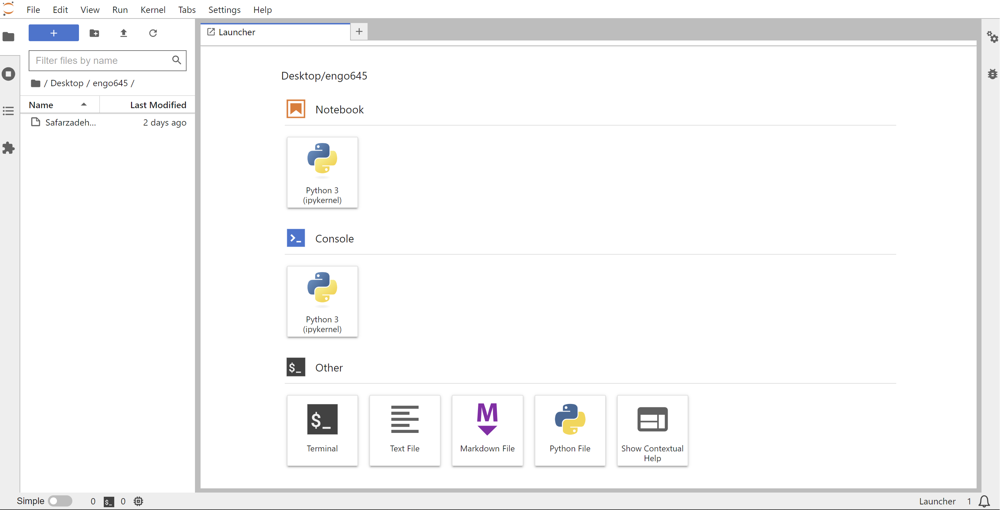
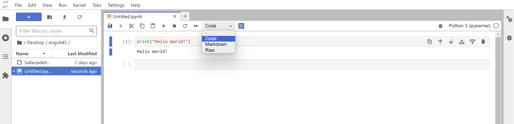
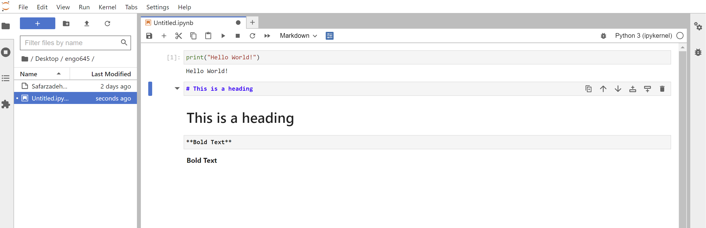

Setting up Python Environment
=====================================

When you want to use Python to write scripts and programmes on your own computer, you need to install Python, 
and possibly some of the many packages for it that provide tools for specific tasks, such as handling GIS data sets. 
On this page, we present one of the ways to install Python and Python packages. 
During this tutorial, we will use the conda package management system, 
and below you will find installation instructions of Anaconda distribution on different operating systems.

.. note:: **Do I need to install anything?**

    You can complete all assignments without installing anything on your computer. 
    The code of each assignment can be completed and run interactively in the web browser based platforms such as Google Colab.
    As long as you can provide the tasks requirements you are free to use any other online or desktop platfrom to write your python codes and markdowns.

What is Anaconda?
-----------------
Anaconda is a distribution of the Python and R programming languages for scientific computing, 
that aims to simplify package management with conda environments.

Anaconda offers the easiest way to perform data science and machine learning on a single machine.

Install Anaconda
----------------

Visit the `Anaconda website <https://www.anaconda.com/download>`_ and download Anaconda for your operating system (Windows, macOS, Linux). 
Choose the version labeled "Download" under the Anaconda Individual Edition.
Once the download has finished, double-click the downloaded installer file to start installation. 
Once the download completes, open the installer. 
Follow the installation instructions, leaving the default options selected unless you have specific preferences. 

.. note::
   Install Anaconda to a directory path that does not contain spaces or unicode characters.

.. figure:: img/anaconda_1.png
   :alt: Anaconda installer
   :width: 500px

   Anaconda installer

Choose the defaul checkbox register Anaconda as your default Python. Don't check the "add Anaconda to your PATH environment"
unless you have or you want to install different versions of python in your system. Otherwise just use the default setting.

.. figure:: img/anaconda_2.png
   :alt: Anaconda installer setup
   :width: 500px

   Anaconda installer setup

.. note::
   If you encounter issues during installation, temporarily disable your anti-virus software during install, 
   then re-enable it after the installation concludes.

After the installation is complete, you'll find Anaconda Navigator installed on your computer. 
You can find it in your Start Menu. This is a graphical interface that helps manage Anaconda and its applications.

.. figure:: img/anaconda_4.png
   :alt: Successfullyinstalled Anaconda
   :width: 500px

   Successfullyinstalled Anaconda

.. note::
   Anaconda Navigator is a graphical user interface (GUI) that is automatically installed with Anaconda. 
   Navigator will open if the installation was successful. 
   If Navigator does not open, something went wrong with your installation.

.. figure:: img/anaconda_5.png
   :alt: Overview of Anaconda Navigator
   :width: 700px

   Overview of Anaconda Navigator

JupyterLab
----------

`JupyerLab <https://jupyterlab.readthedocs.io/en/stable/getting_started/overview.html>`__ is an open-source web-based user interface for doing data science.
The JupyterLab interface consists of different components such as a file browser, terminal, image viewer, console, text editor, etc.

**Jupyter Notebooks** (filename extension ``.ipynb``) are documents inside the JupyterLab environment which contain computer code, and rich text elements (figures, links, etc.).

Jupyter Notebooks are perfect for documenting a data science workflow in an interactive format.

.. important::
   While our tutorials primarily utilize Jupyter Lab, we encourage exploration and adaptation.
   You are free to work in other platforms such as `Google Colab <https://colab.research.google.com>`__ or `VS Code <https://code.visualstudio.com>`__ to interact with ``.ipynb`` files.

   Remember, regardless of the platform used, for consistency and assessment purposes, all submissions should be in the ``.ipynb`` format. 
   Enjoy exploring various environments to enrich your learning experience!

Opening Your First Jupyter Lab
~~~~~~~~~~~~~~~~~~~~~~~~~~~~~~

Find and open Anaconda Navigator. In the Navigator window, locate the "Jupyter Lab" icon and click "Launch." 
This will open a new tab or window in your default web browser.

   Basic view of JupyterLab

In the Jupyter Lab interface, click the "+" icon on the left sidebar and select "Notebook" under "Python 3" to create a new notebook.
This opens a new tab titled "Untitled.ipynb" where you can start working.

The notebook consists of cells. Click on the first empty cell and change its type to "Code" using the dropdown menu in the toolbar (it defaults to "Code" type).
Try entering a simple Python command like :code:`print("Hello World!")` in the cell.

**Running Code Cells:**

To execute the code in the cell, press :kbd:`Shift` + :kbd:`Enter`. You'll see the output displayed just below the cell.

   A Jupyter Notebook open in JupyterLab

**Markdown Cells:**

Create a new cell below the code cell by clicking the "+" icon in the toolbar or pressing B while in command mode (press Esc to enter command mode).
Change the cell type to "Markdown" using the dropdown menu in the toolbar.
Try entering Markdown syntax, such as ``# This is a heading`` or ``**Bold text**``.

   Markdown in Jupyter Notebook

Save your work by clicking "File" > "Save Notebook" or using the shortcut :kbd:`ctrl` + :kbd:`s`.

Page summary
------------
Congratulations! You've explored the basics of Jupyter Lab, executed Python code, and experimented with Markdown cells. 
Jupyter Lab's interactive environment allows for efficient and intuitive coding, documentation, and data analysis. 
Continue experimenting with different functionalities to enhance your learning experience!