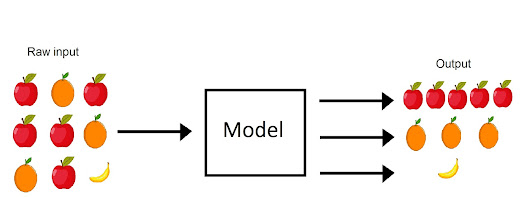
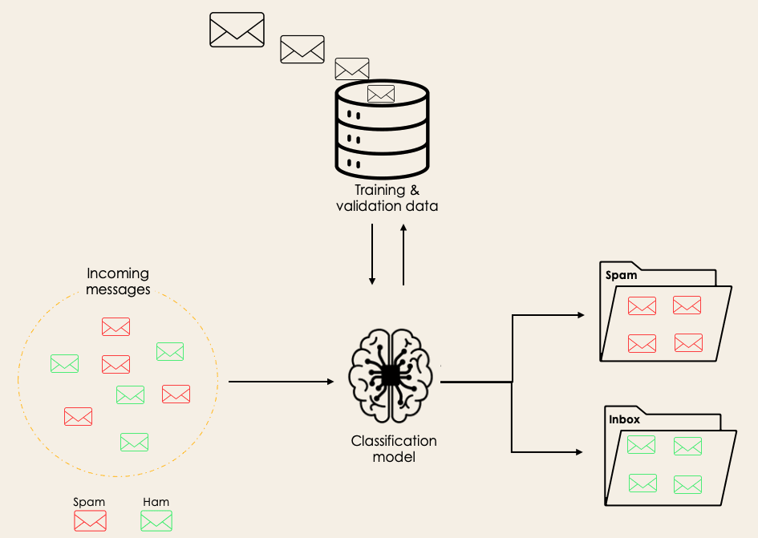
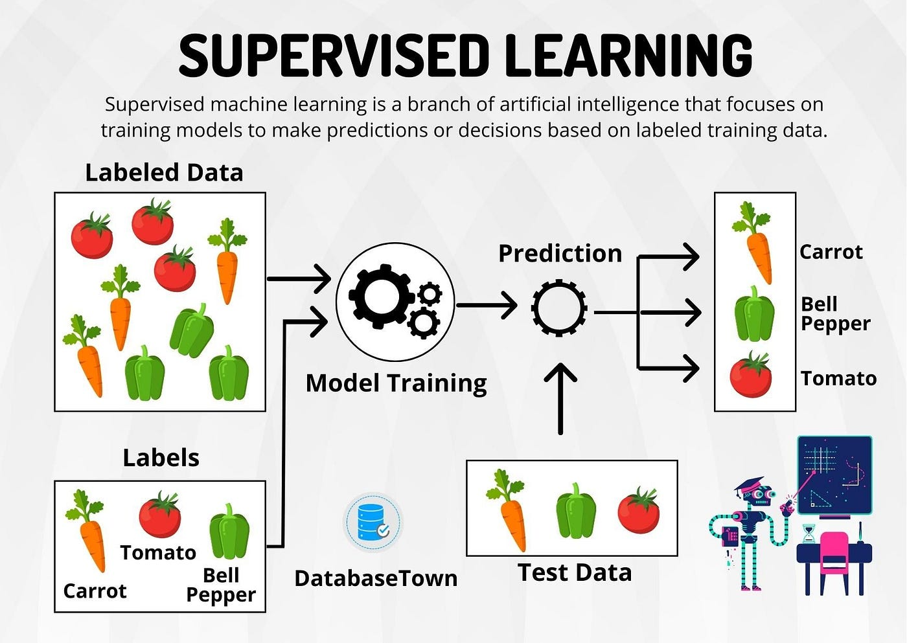
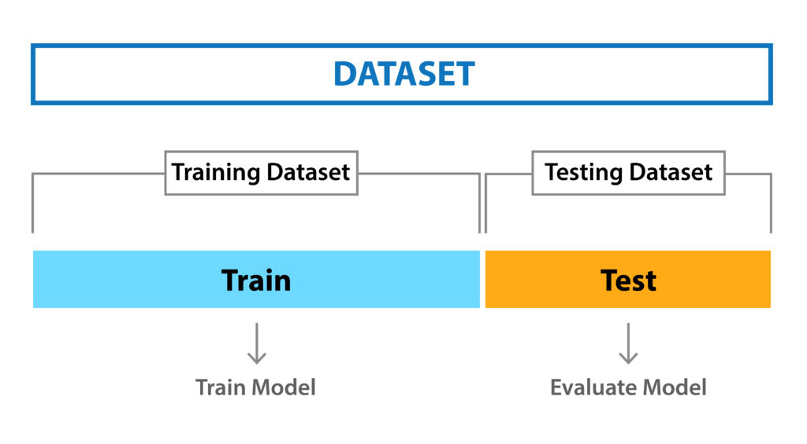

Classification in Machine Learning: An Introduction
===================================================

In this tutorial, we'll dive into the fundamental concept of classification and explore its applications across various domains.

These materials have been adapted from:

- `Classification in Machine Learning: An Introduction <https://www.datacamp.com/blog/classification-machine-learning>`__
- `Classification in Python with Scikit-Learn <https://scikit-learn.org/stable/supervised_learning.html>`__

What is Classification in Machine Learning?
-------------------------------------------
Here a classifier in machine learning is an algorithm that automatically arranges or categorizes data into one or more sets of ‘categories’. 

Imagine you have a collection of fruits, each with distinct attributes like color, shape, and size. Your task is to sort these fruits into different baskets based on their features. 
This process of categorizing fruits and vegetables into groups such as apple or orange, is essentially classification. 

    
    Supervised Learning Classification

Examples of Machine Learning Classification in Real Life
--------------------------------------------------------
Supervised Machine Learning Classification has different applications in multiple domains of our day-to-day life. 
Below are some examples. 

Transportation
~~~~~~~~~~~~~~

- **Traffic Flow Prediction**:
  Supervised learning algorithms can be used to predict traffic flow patterns on roads and highways. 
  For example, historical traffic data, weather conditions, and time of day can be used to classify traffic congestion levels as light, moderate, or heavy. 
  This information can help optimize route planning and traffic management systems.

- **Vehicle Classification**:
  Machine learning models can classify vehicles based on their size, type, and purpose. 
  This classification is useful for toll collection systems, parking management, and traffic enforcement. 
  For instance, image classification algorithms can distinguish between cars, trucks, buses, and motorcycles in surveillance footage or traffic camera feeds.

Sustainable Development
~~~~~~~~~~~~~~~~~~~~~~~

- **Land Cover Classification**:
  Remote sensing data combined with supervised classification algorithms can be used to classify land cover types such as forests, water bodies, agricultural land, and urban areas. 
  This information is crucial for monitoring changes in land use, assessing environmental impact, and planning sustainable development initiatives.

- **Species Identification**:
  Classification algorithms can aid in species identification and biodiversity monitoring. 
  By analyzing ecological data such as species distributions, habitat characteristics, and environmental variables, machine learning models can classify species presence or absence in specific regions, helping conservation efforts and ecosystem management.

Education
~~~~~~~~~

- **Student Performance Prediction**:
  Supervised learning techniques can predict student academic performance based on various factors such as attendance, previous grades, study habits, and socio-economic background. 
  These predictions can help educators identify at-risk students early on and provide targeted interventions to improve learning outcomes.

- **Educational Content Recommendation**:
  Classification algorithms can personalize educational content recommendations for students based on their learning preferences, interests, and proficiency levels. 
  For example, a recommender system powered by machine learning can suggest relevant textbooks, online courses, or learning resources tailored to individual student needs.

Healthcare
~~~~~~~~~

- **Disease Diagnosis**:
  Supervised learning models can assist in medical diagnosis by classifying patients into different disease categories based on symptoms, medical history, diagnostic tests, and imaging data. 
  For instance, machine learning algorithms can analyze medical images such as X-rays, MRIs, or CT scans to detect abnormalities and classify them as indicative of specific diseases or conditions.

- **Drug Response Prediction**:
  Classification algorithms can predict patient responses to different medications and treatment regimens based on genetic markers, demographic information, and clinical variables. 
  This personalized medicine approach helps healthcare providers prescribe the most effective treatments while minimizing adverse effects and optimizing patient outcomes.

Different Types of Classification Tasks in Machine Learning
----------------------------------------------------------

Classification is a supervised learning task in machine learning where the goal is to predict the categorical class labels of new instances based on past observations. 
There are several types of classification tasks, including binary classification, multi-class classification, multi-label classification, and imbalanced classification.

Binary Classification
~~~~~~~~~~~~~~~~~~~~~

Binary classification is a type of classification task where the goal is to classify instances into one of two classes or categories. 
The classes are typically represented as "positive" and "negative" or "1" and "0". 
Examples of binary classification tasks include email spam detection (spam or not spam), medical diagnosis (disease present or absent), fraud detection (fraudulent or non-fraudulent transactions), or classification of students can enter a university or not based on their grades and other factors (will be accepted or not accepted).

**Example: Email Spam Detection**

In email spam detection, the goal is to classify emails as either spam or not spam. The features used for classification may include the presence of certain keywords, email sender information, and email content characteristics. A binary classifier trained on labeled email datasets can predict whether incoming emails are spam or legitimate.

    
    Binary Classification (source: https://www.datacamp.com/blog/classification-machine-learning)

Multi-Class Classification
~~~~~~~~~~~~~~~~~~~~~~~~~~

Multi-class classification is a type of classification task where the goal is to classify instances into one of three or more classes or categories. 
Each instance can belong to only one class, and the classes are mutually exclusive. 
Examples of multi-class classification tasks include hand-written digit recognition (digits 0-9), sentiment analysis (positive, negative, neutral), and image classification (various object categories).

**Example: **Example: Fruit Classification**

Let's say you have a bunch of fruits, like apples, oranges, and bananas. 
You want a computer to tell you which fruit is which just by looking at them. 
You take pictures of each fruit and feed them into a computer program. 
The program learns to recognize different fruits based on their features like color, shape, and size. 
So when you show it a new picture of a fruit, it can tell you if it's an apple, orange, banana, or any other fruit it's been trained on.

    
    Multi-Class Classification

Other Types of Classification Tasks
------------------------------------

- **Multi-Label Classification**: In multi-label classification, each instance can belong to multiple classes simultaneously. 
- For example, a news article may belong to multiple categories such as "politics," "sports," and "technology" simultaneously.

- **Imbalanced Classification**: In imbalanced classification, the distribution of classes in the dataset is skewed, with one class significantly outnumbering the others. 
- This imbalance can lead to biased models and inaccurate predictions, requiring special techniques to handle class imbalance effectively.

.. note::
    
        Understanding the differences between these classification tasks is crucial for selecting appropriate algorithms and evaluation metrics. 
        Binary and multi-class classification are among the most common types of classification tasks encountered in real-world machine learning applications, and mastering them is essential for building accurate and robust classification models.

Different Types of Classification Algorithms
-------------------------------------------

Classification algorithms are methods used to classify data into different categories or classes. 
There are several types of classification algorithms, each with its strengths and weaknesses. 
Some common classification algorithms include:

1. Logistic Regression:
   - Logistic regression is a simple yet powerful algorithm used for binary classification tasks. It models the probability of an instance belonging to a particular class using a logistic function.

2. Decision Trees:
   - Decision trees are tree-like structures where each internal node represents a "decision" based on a feature, and each leaf node represents a class label. There are different types of decision trees, including:
     - CART (Classification and Regression Trees): CART is a type of decision tree algorithm that can be used for both classification and regression tasks.
     - C4.5: C4.5 is an algorithm used to generate decision trees from a dataset. It employs a divide-and-conquer strategy to recursively split the dataset into subsets based on the most informative features.
   
3. Random Forests:
   - Random forests are ensembles of decision trees where each tree is trained on a random subset of the training data and features. They improve upon the performance of single decision trees by reducing overfitting and increasing robustness.

4. Support Vector Machines (SVM):
   - SVM is a powerful algorithm used for binary and multi-class classification tasks. It finds the optimal hyperplane that separates data points into different classes while maximizing the margin between classes.

5. K-Nearest Neighbors (KNN):
   - KNN is a simple and intuitive algorithm that classifies instances based on the majority class of their nearest neighbors. It does not require training and can be used for both binary and multi-class classification tasks.

6. Naive Bayes:
   - Naive Bayes is a probabilistic algorithm based on Bayes' theorem with the "naive" assumption of feature independence. It is particularly effective for text classification tasks such as spam detection and sentiment analysis.

7. Adaptive Boosting (AdaBoost):
   - AdaBoost is an ensemble learning technique that combines multiple weak learners (e.g., decision trees) to create a strong classifier. It iteratively trains classifiers on subsets of the data, focusing on instances that are misclassified by previous classifiers, to improve overall performance.

.. Note:: 
    For more detailed information on classification algorithms and their implementation in Python, I recommend referring to the `scikit-learn documentation <https://scikit-learn.org/stable/user_guide.html>`__. Scikit-learn provides a comprehensive library of machine learning algorithms and tools for building classification models.

How do measure the efficiency of a Classification model?
-------------------------------------------------------

After we build a classification model, we need to evaluate its performance to ensure that it is accurate and reliable.
We can evaluate the performance of a classification model in different ways, including:

- **Holdout Method**: The holdout method involves splitting the dataset into a training set and a test set, training the model on the training set, and evaluating it on the test set.

    
    Holdout Method

- **Cross-Validation**: Cross-validation is a technique used to assess the generalization performance of a model by splitting the dataset into multiple subsets, training the model on a subset, and evaluating it on the remaining subsets. With this technique, the data set is randomly divided into k equal-sized, mutually exclusive subsets. One is retained for testing, while the others are utilized for training the model. For each of the k folds, the same procedure is followed.

.. figure:: img/cross_validation.jpg
    
    Cross-Validation

Evaluation Metrics for Classification Models:
--------------------------------------------
There are several evaluation metrics used to measure the performance of classification models, including:

- **Accuracy**: Accuracy is the proportion of correctly classified instances out of the total instances. It is a simple and intuitive metric but may not be suitable for imbalanced datasets.
- **Precision**: Precision is the proportion of true positive predictions out of all positive predictions. It measures the accuracy of positive predictions and is useful when the cost of false positives is high.
- **Recall**: Recall is the proportion of true positive predictions out of all actual positive instances. It measures the ability of the model to identify positive instances and is useful when the cost of false negatives is high.
- **F1 Score**: The F1 score is the harmonic mean of precision and recall. It provides a balance between precision and recall and is useful when the class distribution is imbalanced.
- **Log Loss or Cross-Entropy Loss**: Log loss is a measure of uncertainty in the predictions of a classification model. It is commonly used for binary and multi-class classification tasks and penalizes incorrect predictions based on the confidence of the model.
- **Confusion Matrix**: A confusion matrix is a table that summarizes the performance of a classification model by comparing actual and predicted class labels. It provides insights into the true positive, true negative, false positive, and false negative predictions.
- **AUC-ROC Curve**: The area under the receiver operating characteristic (ROC) curve is a measure of the trade-off between true positive rate and false positive rate across different threshold values. It provides a comprehensive view of the model's performance across different classification thresholds.

.. note::
    Understanding these evaluation metrics is essential for interpreting the performance of classification models and selecting appropriate metrics based on the specific requirements of the task.
    To learn more about these evaluation metrics and their implementation in Python, I recommend referring to the `scikit-learn documentation <https://scikit-learn.org/stable/modules/model_evaluation.html>`__.

