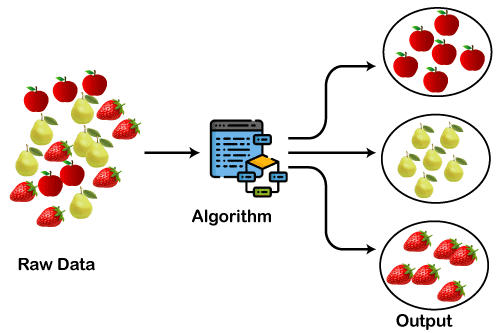
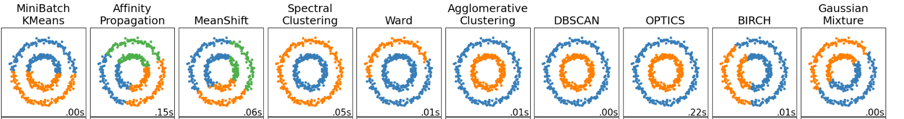
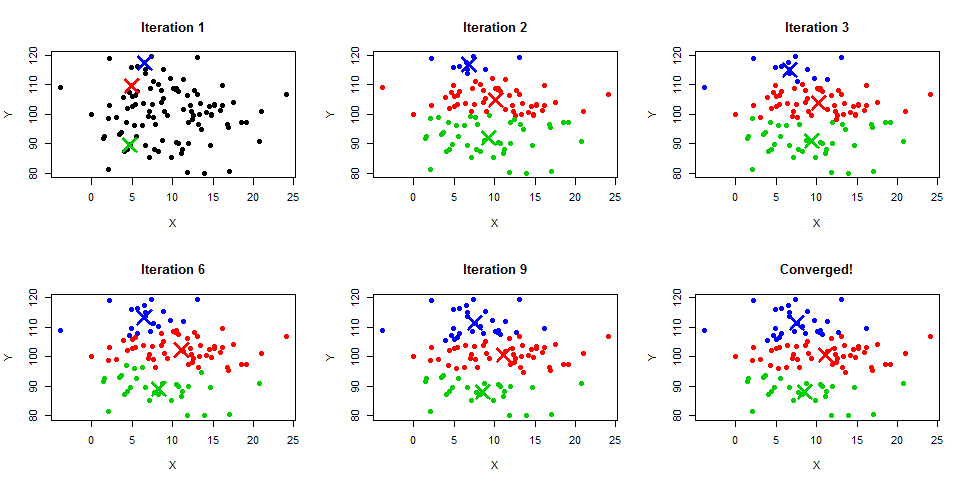
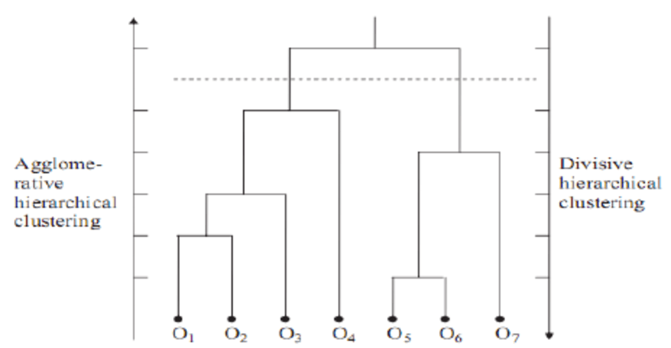

Clustering in Machine Learning: An Introduction
===================================================

In this tutorial, we'll dive into the fundamental concept of clustering and explore its applications across various domains.

These materials have been adapted from:

- `Clustering in Machine Learning <https://www.datacamp.com/blog/clustering-in-machine-learning-5-essential-clustering-algorithms>`__
- `Clustering in Python with Scikit-Learn <https://scikit-learn.org/stable/modules/clustering.html>`__
- `K-Means Clustering in Python <https://www.datacamp.com/tutorial/k-means-clustering-python>`__
- `DBSCAN Clusteringn <https://www.datacamp.com/tutorial/dbscan-macroscopic-investigation-python>`__
- `Introduction to Hierarchical Clustering in Python <https://www.datacamp.com/tutorial/introduction-hierarchical-clustering-python>`__

In this clustering tutorial, you will learn:

- What is clustering?
- 3 essential clustering algorithms:
  - K-Means
  - DBSCAN
  - Hierarchical clustering

What is clustering in Machine Learning?
-------------------------------------------
Clustering is an unsupervised machine learning technique with a lot of applications in the areas of pattern recognition, image analysis, customer analytics, market segmentation, social network analysis, and more. 
A broad range of industries use clustering, from airlines to healthcare and beyond. 

It is a type of unsupervised learning, meaning that we do not need labeled data for clustering algorithms; this is one of the biggest advantages of clustering over other supervised learning like Classification. 

Let’s say we have a huge collection of image dataset containing three fruits (i) strawberries, (ii) pears, and (iii) apples. 

In the dataset all the images are mixed up and your use-case is to group similar fruits together i.e. create three groups with each one of them containing one type of fruit. This is exactly what a clustering algorithm will do. 

    
    Unsupervised Learning clustering

Key Success Criteria for Clustering Analysis
----------------------------------------------

Clustering, unlike supervised learning use-cases such as classification, cannot be completely automated end-to-end. Instead, it is an iterative process of information discovery that requires domain expertise and human judgment used frequently to make adjustments to the data and the model parameters to achieve the desired result. 

Most importantly, because clustering is unsupervised learning and doesn’t use labeled data, we cannot calculate performance metrics like accuracy, AUC, RMSE, etc., to compare different algorithms or data preprocessing techniques. As a result, this makes it really challenging and subjective to assess the performance of clustering models. 

The key success criteria in clustering models revolve around:

- Is it interpretable?
- Is the output of clustering useful for business?
- Have you learned new information or discovered new patterns in the data that you weren’t aware of before clustering?

Comparison of Different Clustering Algorithms
----------------------------------------------

There are totally 10 unsupervised clustering algorithms implemented in scikit-learn - a popular machine learning library in Python. 
There are fundamental underlying differences in how each algorithm determines and assigns clusters in the dataset. 

The underlying differences in the mathematical modality of these algorithms boil down to four aspects on which we can compare and contrast these algorithms:

- Parameters required for the model 
- Scalability 
- Use-cases, 
- Geometry, i.e., metric used for calculation of distances. 
Let’s focus on the output of these algorithms. In the diagram 
below, each column represents an output from a different clustering algorithm such as KMeans, Affinity Propagation, MeanShift, etc. 
There are a total of 10 algorithms that are trained on the same dataset.

Some algorithms have yielded the same output. 
Notice Agglomerative Clustering, DBSCAN, OPTICS, and Spectral Clustering have resulted in the same clusters. 

However, if you notice and compare the output of KMeans with the output of MeanShift algorithm, you will notice both the algorithms yielded different results. 
In the case of KMeans, there are only two groups (clusters: blue and orange), whereas, in the case of MeanShift, there are three i.e., blue, green, and orange. 

    
    Image Source: https://scikit-learn.org/stable/_images/sphx_glr_plot_cluster_comparison_001.png

  
Unfortunately (or fortunately), there is no right or wrong answer in Clustering. 
It would have been so simple to determine and make a statement like “X Algorithm is performing best here.” 

This is not possible and it is because of this reason clustering is a very challenging task. 

Ultimately, which algorithm works better doesn’t depend on any metric that is easily measurable but rather on the interpretation and how useful the output is for the use-case in hand.

3 Essential Clustering Algorithms
--------------------------------

In this section, we will explore three essential clustering algorithms:

- K-Means
- DBSCAN
- Hierarchical clustering

K-Means Clustering
~~~~~~~~~~~~~~~~~~

K-Means clustering algorithm is easily the most popular and widely used algorithm for clustering tasks. 
It is primarily because of the intuition and the ease of implementation. 
It is a centroid-based algorithm where the user must define the required number of clusters it wants to create. 

This normally comes from business use-case or by trying different values for the number of clusters and then evaluating the output. 

K-Means clustering is an iterative algorithm that creates non-overlapping clusters meaning each instance in your dataset can only belong to one cluster exclusively. 
The easiest way to get the intuition of the K-Means algorithm is to understand the steps along with the example diagram below. 

The K-Means algorithm works as follows:

1. User specifies the number of clusters.
2. Initialize centroids randomly based on the number of clusters. In the diagram below in Iteration 1, notice three centroids are initialized randomly in blue, red, and green colors.
3. Calculate the distance between data points and each centroid and assign each data point to the nearest centroids.
4. Recalculate the mean of the centroid based on all the assigned data points, and this will change the position of the centroid, as you can see in Iteration 2 - 9, until it finally converges.
5. Iteration keeps on going until there is no change to the centroid's mean or a parameter max_iter is reached, which is the maximum number of the iterations as defined by the user during training. In scikit-learn, max_iter by default is set to 300.

    
    Image Source: https://www.learnbymarketing.com/wp-content/uploads/2015/01/method-k-means-steps-example.png

DBSCAN (Density-Based Spatial Clustering of Applications with Noise)
~~~~~~~~~~~~~~~~~~~~~~~~~~~~~~~~~~~~~~~~~~~~~~~~~~~~~~~~~~~~~~~~~~~

DBSCAN or Density-Based Spatial Clustering of Applications with Noise is an unsupervised clustering algorithm that works on the premise that clusters are dense spaces in the region separated by lower-density regions. 

The biggest advantage of this algorithm over K-Means and MeanShift is that it is robust to outliers meaning it will not include outliers data points in any cluster. 

DBSCAN algorithms require only two parameters from the user: 

- The radius of the circle to be created around each data point, also known as ``epsilon``
- ``minPoints`` which defines the minimum number of data points required inside that circle for that data point to be classified as a Core point.

Every data point is surrounded by a circle with a radius of epsilon, and DBSCAN identifies them as being either a Core point, Border point, or Noise point. 
A data point is considered to be a Core point if the circle that surrounds it has a minimum number of points specified by minPoints parameter. 

It is considered a Border Point if the number of points is lower than the minimum required, and it is considered Noise if there are no additional data points located within an epsilon radius of any data point. Noise data points are not categorized in any cluster (basically, they are outliers).

Some of the common use-cases for DBSCAN clustering algorithm are:

- It performs great at separating clusters of high density versus low density;
- It works great on non-linear datasets; and
- It can be used for anomaly detection as it separates out the noise points and do not assign them to any cluster.

.. note::

    Comparing DBSCAN with K-Means algorithms, the most common differences are: 

    - K-Means algorithm cluster all the instances in the datasets whereas DBSCAN doesn’t assign noise points (outliers) to a valid cluster
    - K-Means has difficulty with non-global clusters whereas DBSCAN can handle that smoothly
    - K-Means algorithm makes assumptions that all data points in the dataset come from a gaussian distribution whereas DBSCAN makes no assumption about the data.

.. figure:: img/DBSCAN.gif
    
    Image Souce: https://miro.medium.com/proxy/1*tc8UF-h0nQqUfLC8-0uInQ.gif

Hierarchical Clustering
~~~~~~~~~~~~~~~~~~~~~~~~

Hierarchical clustering is a method of clustering that builds a hierarchy of clusters. There are two types of this method. 

- **Agglomerative**: This is a bottom-up approach where each observation is treated as its own cluster in the beginning and as we move from bottom to top, each observation is merged into pairs, and pairs are merged into clusters. 
- **Divisive**: This is a "top-down" approach: all observations start in one cluster, and splits are performed recursively as we move from top to bottom.
When it comes to analyzing data from social networks, hierarchical clustering is by far the most common and popular method of clustering. The nodes (branches) in the graph are compared to each other depending on the degree of similarity that exists between them. By linking together smaller groups of nodes that are related to one another, larger groupings may be created.

The biggest advantage of hierarchical clustering is that it is easy to understand and implement. Usually, the output of this clustering method is analyzed in an image such as below. It is called a Dendrogram.

  Image Source: https://www.researchgate.net/profile/Rahmat-Widia-Sembiring/publication/48194320/figure/fig1/AS:307395533262848@1450300214331/Example-of-a-dendrogram-from-hierarchical-clustering.png

Conclusion
-----------

Clustering is a very useful machine learning technique, but it is not as straightforward as some of the supervised learning use-cases like classification and regression. 
It is mostly because the performance evaluation and assessing the quality of the model is hard as well as there are some critical parameters such as the number of clusters that the user must define correctly to get meaningful results. 

However, there are tons of use-cases of clustering in a wide range of industries, and it is an important skill even for data scientists, machine learning engineers, and data analysts. 

If you would like to learn more about Clustering and unsupervised machine learning and learn the implementation using Python and R language, the courses below can help you make progress:

